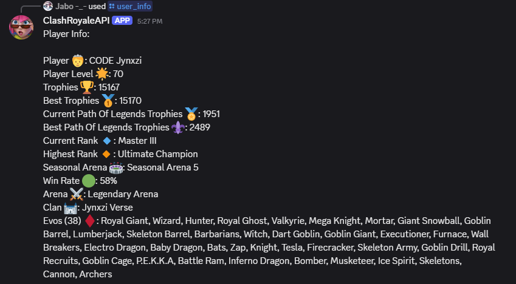

# ClashRoyaleAPI
Discord Bot to retrieve live user information from Clash Royale

# Features

- /user_info to retrieve user information

- /clan_info to retrieve clan information

- /user_battlelog to retrieve a user's most recent battle

# Prerequisites

- Python 3.8+ installed on your system

- A Discord application and bot token (you can create this at the Discord Developer Portal: https://discord.com/developers/applications)

- Git for cloning the repository

# Setup and Installation

1. Clone the repository

git clone https://github.com/<your-username>/ClashRoyaleAPI.git
cd ClashRoyaleAPI

2. Create and activate a virtual environment

python3 -m venv venv
source venv/bin/activate # macOS/Linux
venv\Scripts\Activate # Windows PowerShell

3. Install dependencies

pip install -r requirements.txt

4. Create a .env file in the project root and set the following

DISCORD_TOKEN = your_bot_token_here (this is provided to you when you create your bot in the Dev Portal, if you don't remember it, you have the option to reset it and a new one will be generated)

CLASH_API_KEY= your_API_key_here (this is provided to you when you create a developer account in the official Clash Royale API website. Follow the steps shown in the website to generate your key)

# Configuration

- Discord intents: In Discord's Dev Portal, under your bot's settings,enable the Message Content Intent so the bot can read message text

# Usage

1. Start the bot

pyhton main.py

2. Run the commands in Discord

/user_info
/user_battlelog
/clan_info

# Troubleshooting

- Bot not responding: Check that DISCORD_TOKEN is correct and the bot is invited to your server. Also check if the API key you entered is a valid key, the bot will not retireve data from the API without providing a valid key

- Missing intents errors: Enable the Message Content Intent in the Discord Developer Portal